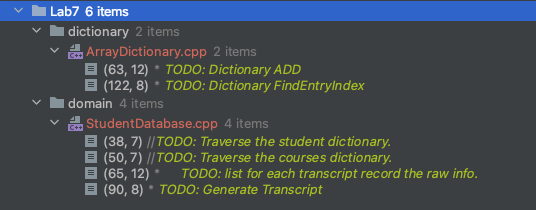

# Laboratory #7 - Dictionaries

-----
**CSCI2421 - Summer 2021**

### **_Team Members Names:_**
- Student #1: `Darius Deese`
- Student #2: `Ray Khan`

### **Lab Status**
```text
Describe **briefly** how complete your lab is, and how did you tested it.
Our lab seems to run properly. We ran into issues with displaying the transcripts etc but located the errors in
the for loops and pointer references.
Does it work on CSEGrid?
Yes.

-----

## TODO:
1. Complete your and your teammates' names on the top of this document.
1. Open the **TODO tab** on CLION, and complete the implementation. (Image below shows a snapshot of that).
1. **Document your code**, as described on Canvas.
1. All team members should be working concurrently using **code-with-me on Clion**.
1. If you have questions, use Zoom _"Ask for help button"_ on the toolbar (bottom), and the instructors will get to
   your room asap. You can also use Slack concurrently.
1. **Please keep your camera turned on, so you can interact with your team.**
1. Instructors will be walking through the rooms regularly.
1. Push your solution to GitHub
1. Pull your solution from git into CSEGrid
1. Compile it and run it on CSEGrid using `make`.
1. **Capture a screenshot and save it on your CLion Project folder.**
1. Complete the *Lab Status* section on this document.
1. Complete Discussion.




## Submission
- Complete the lab.
- On CLion execute Build --> Clean from the menu (this will remove all temporary files)
- Using zip, compress the entire CLion Project and upload it to canvas before 11:59am.
    - Remember to add your CSE grid screenshot to your sources folder!
- **LATE SUBMISSIONS**
    - The assignment will be open till 3pm.
    - Submitting after 11:35am will imply a 20% penalty.
    - Submit your lab to your Lab 6 assignment on Canvas.
- Zoom session will close after our class time    


## Domain Description
We will implement a simplistic view of a Database. 
You will discuss this further on DB Systems (CSCI3287).

You will have two tables `Students` and `Courses` that are accessed by
the id of each object. 
Moreover, there's a third collection of records, corresponding to the transcripts
You will generate the transcripts by connecting the data from these records with the students
and courses. 

You will finalize the implementation of the dictionary. 

Check the [pdf](./w07.Lab.Dicts.pdf), for the slides discussed in the presentation of this lab.

**Discuss with your partner and ASK QUESTIONS!**